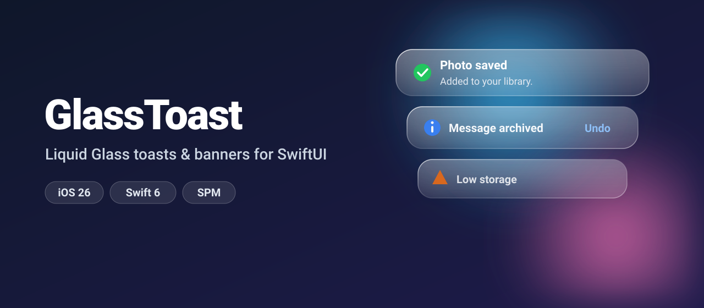
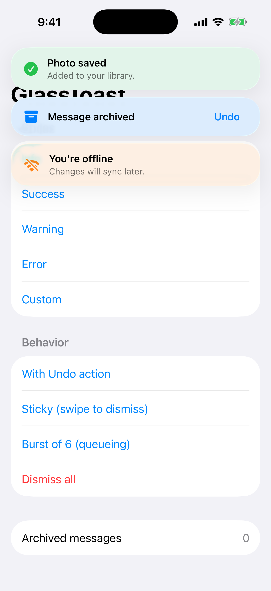
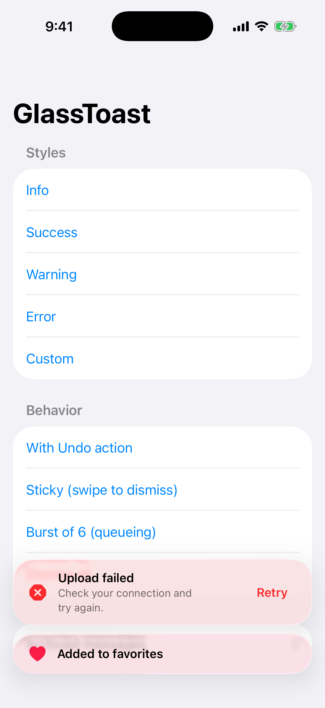
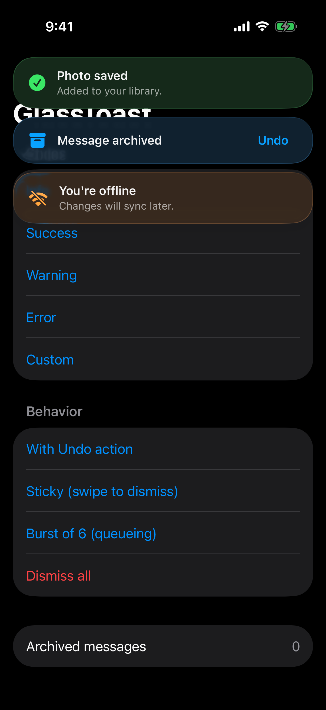

<p align="center">
  
</p>

<p align="center">
  <a href="https://github.com/halilozel1903/GlassToast/actions/workflows/ci.yml"></a>
  
  
  
  
  <a href="LICENSE"></a>
</p>

**GlassToast** is a tiny, dependency-free SwiftUI library for toasts, snackbars and banners that look native on **iOS 26 Liquid Glass**, and degrade gracefully to materials on iOS 17 through 18.

One line to install, one modifier to host, one call to show.

```swift
toasts.show(.success("Photo saved", message: "Added to your library."))
```

## Screenshots

Captured from the example app on an iOS 26 simulator by CI.

| Stacked toasts | Bottom edge | Dark mode |
| :---: | :---: | :---: |
|  |  |  |

## Features

- 🧊 **Real Liquid Glass** via `glassEffect` and `GlassEffectContainer` on iOS 26 / macOS 26, so stacked toasts melt into each other.
- 🪄 **Graceful fallback** to `ultraThinMaterial` on iOS 17 and 18, same API.
- 📚 **Smart queue**: a maximum number on screen, the rest wait their turn; identical toasts are de-duplicated.
- 👆 **Swipe to dismiss** with rubber-banding, and the timer pauses while the finger is down.
- ↩️ **Actions** like *Undo*, with automatic dismissal after tap.
- 📳 **Haptics** that match the style (`success`, `warning`, `error`).
- ♿️ **Accessible**: combined VoiceOver element with a *Dismiss* action.
- 🧵 **Swift 6 strict concurrency**, `@Observable`, `Sendable` models.
- 🧪 **Tested** with Swift Testing; the queue is a pure value type you can reuse.

## Installation

### Swift Package Manager

In Xcode choose **File › Add Package Dependencies…** and enter:

```
https://github.com/halilozel1903/GlassToast
```

Or add it to `Package.swift`:

```swift
dependencies: [
    .package(url: "https://github.com/halilozel1903/GlassToast", from: "1.0.0")
]
```

## Quick start

**1. Host** the toasts once, at the root of a window:

```swift
import GlassToast
import SwiftUI

@main
struct MyApp: App {
    @State private var toasts = ToastCenter()

    var body: some Scene {
        WindowGroup {
            ContentView()
                .toastHost(toasts)          // or .toastHost(toasts, edge: .bottom)
        }
    }
}
```

**2. Show** them from anywhere below:

```swift
struct ContentView: View {
    @Environment(ToastCenter.self) private var toasts

    var body: some View {
        Button("Save") {
            toasts.show(.success("Saved"))
        }
    }
}
```

## Usage

### Styles

```swift
toasts.show(.info("New version available"))
toasts.show(.success("Photo saved", message: "Added to your library."))
toasts.show(.warning("Low storage"))
toasts.show(.error("Upload failed", message: "Check your connection."))

// Your own tint and SF Symbol
toasts.show("Added to favorites", style: .custom(tint: .pink, systemImage: "heart.fill"))
```

### Actions

```swift
toasts.show(Toast(
    title: "Message archived",
    systemImage: "archivebox.fill",
    duration: .long,
    action: ToastAction("Undo") { restoreMessage() }
))
```

### Durations

| Value | Behavior |
| --- | --- |
| `.short` | 2.5 seconds (default) |
| `.long` | 4.5 seconds |
| `.seconds(8)` | Any number of seconds |
| `.indefinite` | Stays until swiped away or dismissed in code |

```swift
let offline = Toast(title: "You're offline", style: .warning, duration: .indefinite)
toasts.show(offline)
// later
toasts.dismiss(offline.id)
```

### Queueing

```swift
let toasts = ToastCenter(maxVisible: 2, dropsDuplicates: true)
```

When more toasts arrive than `maxVisible`, they wait in line and slide in as soon as a slot frees up. Each promoted toast gets its own full duration.

## How it looks on each OS

| | iOS 26 / macOS 26 | iOS 17 – 18 / macOS 14 – 15 |
| --- | --- | --- |
| Background | `glassEffect(.regular.tint(…).interactive())` | `.ultraThinMaterial` + hairline border + soft shadow |
| Grouping | `GlassEffectContainer` merges nearby toasts | Regular stack |
| Motion | Spring slide + scale | Same |

## Example app

The `Example` folder contains a demo app that shows every style, actions, sticky toasts and queueing. It uses [XcodeGen](https://github.com/yonaskolb/XcodeGen) so no project file has to live in the repo:

```bash
brew install xcodegen
cd Example && xcodegen generate
open GlassToastDemo.xcodeproj
```

## Requirements

- Xcode 26 or later (Swift 6.2 toolchain)
- iOS 17+ / macOS 14+ (Liquid Glass automatically on 26+)

## Contributing

Issues and pull requests are welcome. Please run `swift test` before opening a PR.

## License

GlassToast is available under the MIT license. See [LICENSE](LICENSE).
